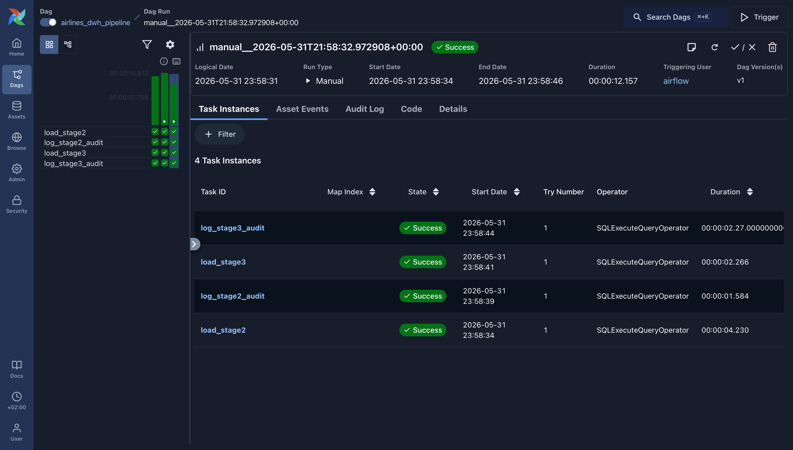
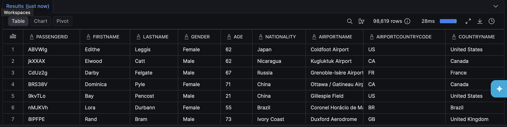
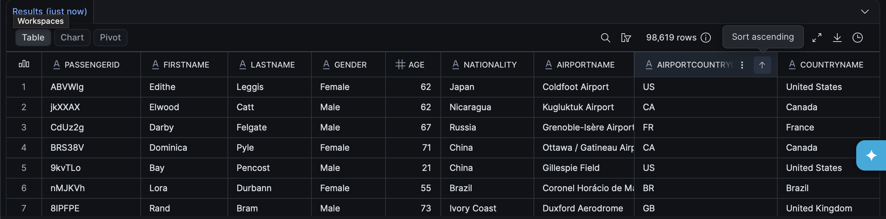
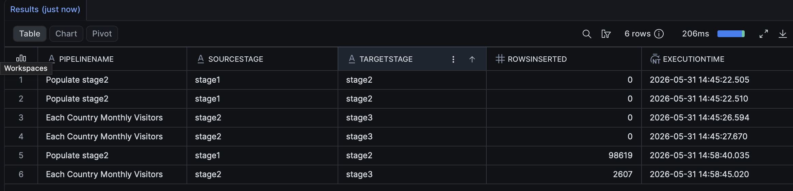
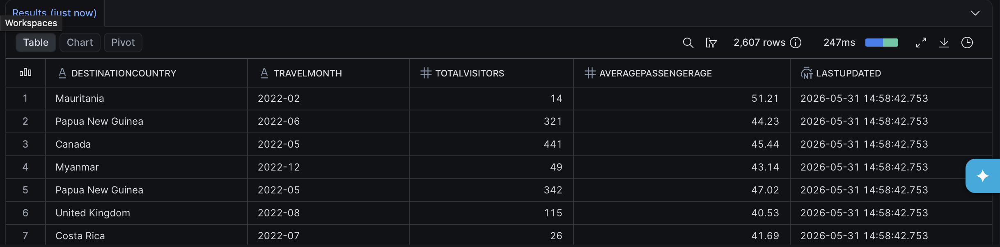
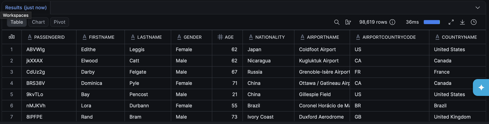

# Snowflake Task

# Table of Content
* [Database](#database)
* [DAG](#dag)
    * [airlines_dag.py](#airlines_dagpy)
* [Snowflake](#snowflake)

## Database
Download the required Airline dataset from [Google Drive](https://drive.google.com/file/d/1IzIRc8zC49sQs8vEUw2k4zV37DIu5rkU/view).
From `snowflake/populate_table.sql` execute first query to create csv file format, then second query to create dataset stage for stage1. Navigate the following way Left Side Bar->Catalog->Database Explorer->INNOWISE_SNOWFLAKE_LMS->STAGE1->Stages->Dataset and click on +Files in the right upper corner. Paste your downloaded file here and lastly execute the final query from the given SQL file (All of this should be done in Snowflake UI).

## DAG
### airlines_dag.py:
This DAG is responsible for automation of processing and logging process:
- `load_stage2` - This SQLExecuteQueryOperator calls existing procedure when it is triggered. The procedure populates the stage2 **airilnes** table by applying type conversions for making dataset structure accurate
- `log_stage2_audit` - This SQLExecuteQueryOperator logs the number of affected rows when migrating data from stage1 to stage2
- `load_stage3` - This SQLExecuteQueryOperator calls existing procedure when it is triggered. The procedure populates the stag3 table **visitors_per_month** by applying aggregation functions to get information about how many visitors had each contry per month and what was their average age
- `log_stage3_audit` - This SQLExecuteQueryOperator logs the number of affected rows when migrating data from stage2 to stage3

## Snowflake
This folder includes scripts from Snowflake:
- `db_definition.sql` - This SQL script is a definition of INNOWISE_SNOWFLAKE_LMS database created within Snowflake UI
- `task.sql` - This SQL script contains additional tasks: writing 2 DDL and 2 DML scripts (executed within Snowflake UI)

## Airflow UI
Below you can see that all of the tasks are in a successful state after DAG run


## Snowflake UI
### Stage1 Airlines Table
Below you can see the result of query 
``` sql
SELECT * FROM stage1.airlines; 
```


### Stage2 Airlines Table
Below you can see the result of query:
``` sql
SELECT * FROM stage2.airlines; 
```
As you see all of the columns are VARCHAR type


### Stage2 Audit Table
Below you can, see the result of query
``` sql
SELECT * FROM stage2.audit; 
```
As you see, modifications were made, for example `Age` column is INT not VARCHAR


### Stage3 Visitors Per Month Table
Below you can see the result of query
``` sql
SELECT * FROM stage3.visitors_per_month; 
```
Here is calculated the number or visitors per month in each country and their average ages 


### Stage3 Secure View
Below you can see the result of query
``` sql
SELECT * FROM stage3.secure_airlines_fact; 
```
Everything is visible, as the user has access to it
