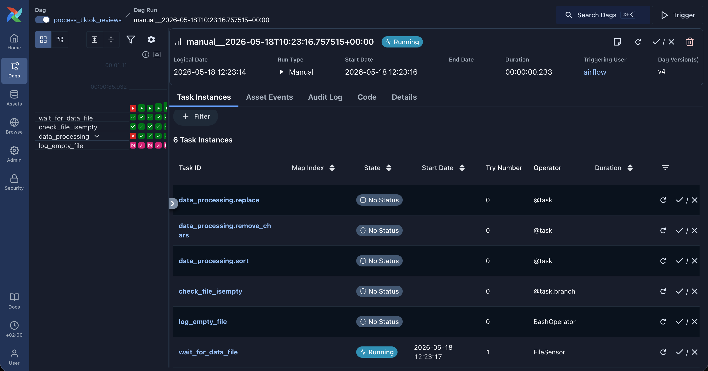
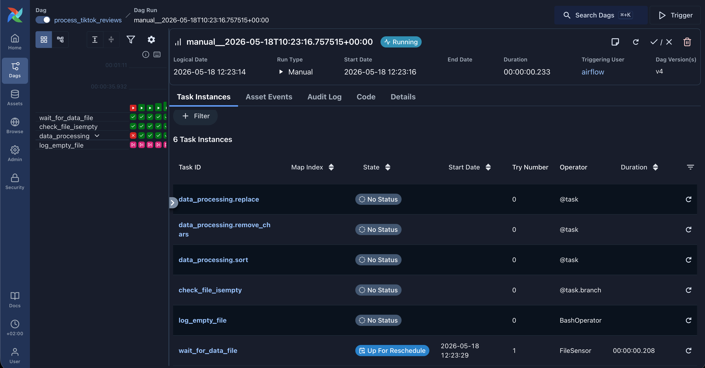
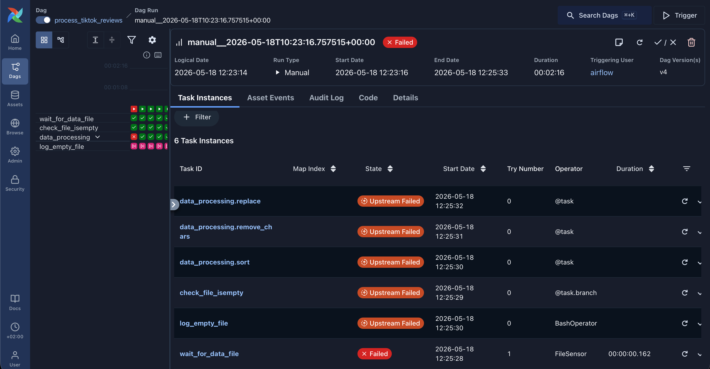
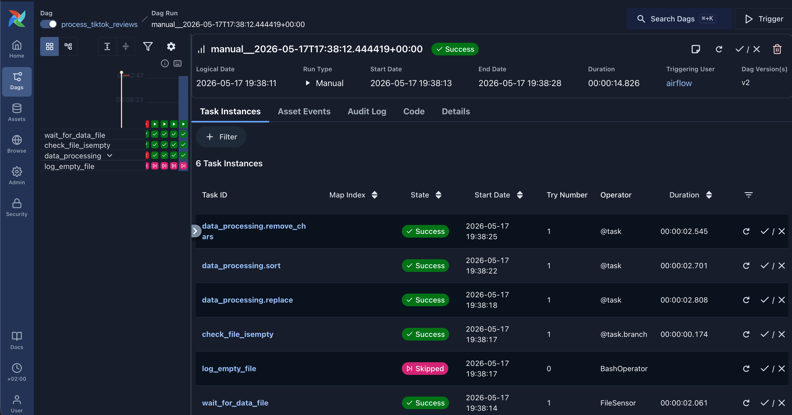
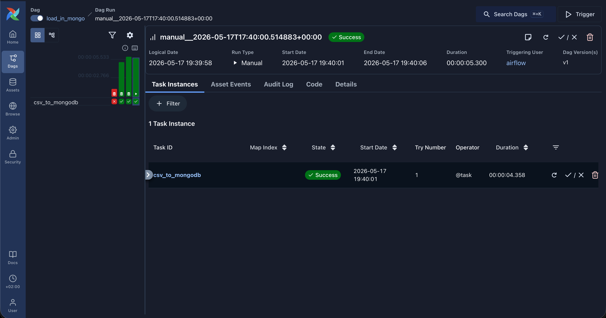
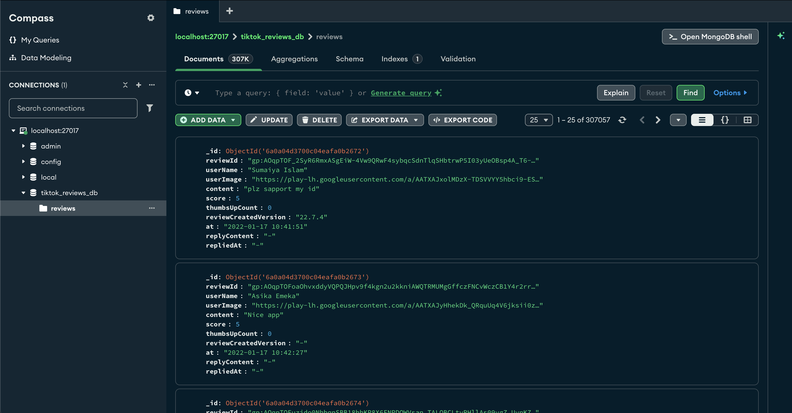

# Airflow Task

## Table of Contents
* [Project Structure](#project-stucture)
  * [process_data.py](#process_datapy)
  * [load_data.py](#load_datapy)
  * [requirements.txt](#requirementstxt)
  * [docker-compose.yaml](#docker-composeyaml)
  * [.env](#env)
* [Airflow UI](#airflow-ui)
  * [File Sensor Running](#filesensor-running)
  * [File Sensor Up For Reschedule](#filesensor-up-for-reschedule)
  * [File Sensor Failed](#filesensor-failed)
  * [DAG Process Tiktok reviews](#dag-process-tiktok-reviews)
  * [DAG Load in MongoDB](#dag-load-in-mongo)
  * [Data in MongoDB](#data-in-mongodb)
* [MongoDB Queries](#mongodb-queries)
  * [Top 5 frequently occurring comments](#top-5-frequently-occurring-comments)
  * [All entries where the “content” field is less than 5 characters long](#all-entries-where-the-content-field-is-less-than-5-characters-long)
  * [Average rating for each day (the result should be in timestamp type)](#average-rating-for-each-day-the-result-should-be-in-timestamp-type)


## Project Structure
- dags
  - Two DAG Files: `process_data.py` and `load_data.py`
- data
  - Two .csv Files: `processed_reviews.csv` and `tiktok_google_play_reviews.csv`
- `requirements.txt`
- `docker-compose.yaml`
- `.env`

---
### process_data.py
This python file consists of a dag with id `process_tiktok_reviews` which is triggered manually. The functionality is following:
- **`wait_for_data_file`** - FileSensor which reacts for the file appearance
- **`check_file_isempty()`** - Task Branch which checks wether file is empty or not
  - **`log_empty_file`** - BashOperator which echoes warning command if file is empty
  - **`data_processing()`** - Task Group which is called if file is not empty
    - **`sort()`** - Task which sorts records by 'at' column
    - **`remove_chars()`** - Task which removes special characters and emojis
    - **`replace()`** - Task which replaces nulls and NaNs with '-' and assets 'processed_reviews.csv' file

*Note: remove_chars() task empties the cells which contain only special characters. Consequently, way the empty strings are treated as NaNs when writing back to file. To avoid repetition, I moved replace() function at the end.*

---

### load_data.py
This python file consists of a dag with id `load_in_mongo` which is triggered by asseted 'processed_reviews.csv' file. The functionality is following:
- **`csv_to_mongodb()`** - Task which saves processed data in MangoDB Database

---

### requirements.txt
This text file consists of libraries that are necessary to be included within the container

---

### docker-compose.yaml
This YAML file configures Airflow working environment. Main additions are:
- Service for `mongo`
- Default connection to MongoDB
- Default path to data files
- Path to required libraries requirements.txt

---

### .env
This .env file consists of environmental variables mainly for MongoDB

---

## Airflow UI
### FileSensor Running
When DAG is triggered, FileSensor is run to check that file exists at a specified location


---

### FileSensor Up For Reschedule
When FileSensor checks for the file and it doesn't exist, it is up for reschedule. It checks again and again in every `poke_interval` seconds


---

### FileSensor Failed
When `timeout` seconds pass, if the file still doesn't exist, the DAG fails    


---

### DAG Process Tiktok Reviews
When FileSensor is successful, the DAG continues completing tasks   


---

### DAG Load in MongoDB
When the first DAG is successful, the second DAG is triggered automatically


---

### Data in MongoDB
When the second DAG is successful, processed data is saved in MongoDB database


## MongoDB Queries 
Using MongoDB Compass
### Top 5 frequently occurring comments
To fetch top 5 frequently occuring comments we need `3` stages:
- **$group**: Group by `'content'` column, count occurrences and save sum in `'comment_count'` column
- **$sort**: Sort by `'comment_count'` column
- **$limit**: Fetch top 5 frequently occuring comments

```json
[
  {
    $group: {
      _id: "$content",
      comment_count: {
        $sum: 1
      }
    }
  },
  
  {
  $sort: {
      comment_count: -1
      }
  },
  
  {
      $limit: 5
  }
]
```

### All entries where the “content” field is less than 5 characters long
To fetch all entries where the `'content'` field is less than 5 characters long we need `1` stage:
- **$match**: Convert `'content'` column to string, count its length and compare if it is less than 5
```json
[
  {
    $match: {
      $expr: {
        $lt: [
          {
            $strLenCP: {
              $toString: "$content"
            }
          },
          5
        ]
      }
    }
  }
]
```

### Average rating for each day (the result should be in timestamp type)
To fetch average rating for each day and return result in timestamp type we need `2` stages:
- **$group**: Extract date part from `'at'` column (first 10 chars) and count average score for each day
- **$project**: Convert resulting `'_id'` column back to timestamp type
```json
[
  {
    $group: {
      _id: {
        $substrCP: ["$at", 0, 10]
      },
      score_avg: {
        $avg: "$score"
      }
    }
  },
  {
    $project: {
      _id: {
        $toDate: "$_id"
      },
      score_avg: 1
    }
  }
]
```