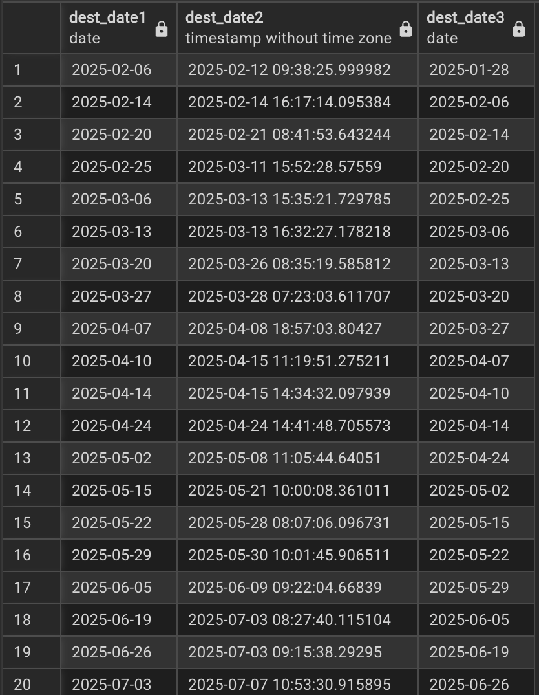
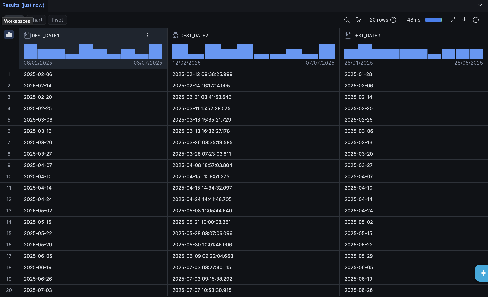

# Snowflake Task2

## Task Description
``` txt
Determine if it is possible to replace following code with a kind of cycle in SQL procedure. (i.e how to do it in Postgres and Snowflake)? 
Result would be a separate SQL file with a Postgres solution, and second file with a Snowflake solution.
```
``` sql
call test_2('2025-02-06','2025-02-12 09:38:25.999982000','2025-01-28');
call test_2('2025-02-14','2025-02-14 16:17:14.095384000','2025-02-06');
call test_2('2025-02-20','2025-02-21 08:41:53.643244000','2025-02-14');
call test_2('2025-02-25','2025-03-11 15:52:28.575590000','2025-02-20');
call test_2('2025-03-06','2025-03-13 15:35:21.729785000','2025-02-25');
call test_2('2025-03-13','2025-03-13 16:32:27.178218000','2025-03-06');
call test_2('2025-03-20','2025-03-26 08:35:19.585812000','2025-03-13');
call test_2('2025-03-27','2025-03-28 07:23:03.611707000','2025-03-20');
call test_2('2025-04-07','2025-04-08 18:57:03.804270000','2025-03-27');
call test_2('2025-04-10','2025-04-15 11:19:51.275211000','2025-04-07');
call test_2('2025-04-14','2025-04-15 14:34:32.097939000','2025-04-10');
call test_2('2025-04-24','2025-04-24 14:41:48.705573000','2025-04-14');
call test_2('2025-05-02','2025-05-08 11:05:44.640510000','2025-04-24');
call test_2('2025-05-15','2025-05-21 10:00:08.361011000','2025-05-02');
call test_2('2025-05-22','2025-05-28 08:07:06.096731000','2025-05-15');
call test_2('2025-05-29','2025-05-30 10:01:45.906511000','2025-05-22');
call test_2('2025-06-05','2025-06-09 09:22:04.668390000','2025-05-29');
call test_2('2025-06-19','2025-07-03 08:27:40.115104000','2025-06-05');
call test_2('2025-06-26','2025-07-03 09:15:38.292950000','2025-06-19');
call test_2('2025-07-03','2025-07-07 10:53:30.915895000','2025-06-26');
```

## My solution
Task shows that database is supposed to be populated with given data using cyclic procedure:  
    - Created source table with this specific data with only first two columns  
    - Automated insertion of 3rd column as I saw the correlation between 1st and 3rd columns  
    - Ommited additional creation of procedure test_2 that would deal with passed row insertion  
    - Created a single procedure responsible for populating new `destination` table from given data with automated 3rd column insertion. 

## Result
Below are given results for both files:
**PostgreSQL Result**


**Snowflake Result**


***Personal Notice***: Cyclic approach for populating table is not efficient.